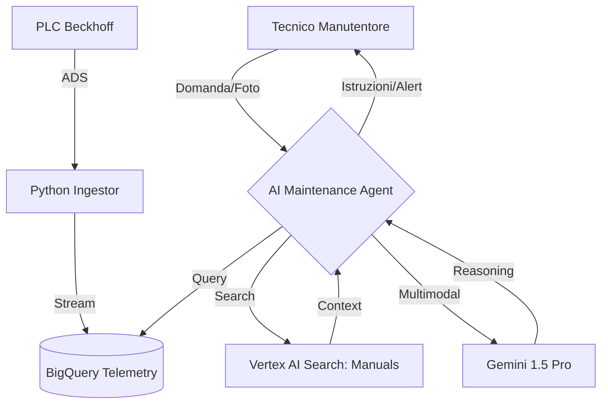

# Karlville Swiss: AI Maintenance Agent (POC)

Questo progetto implementa un assistente intelligente basato su agenti per la manutenzione predittiva e straordinaria dei macchinari Karlville Swiss (basati su PLC Beckhoff).

## 1. Architettura del Sistema

L'agente utilizza **LangGraph** per orchestrare il flusso di lavoro, integrando dati in tempo reale (ADS/BigQuery) e documentazione tecnica (RAG su Vertex AI Search).



## 2. Struttura del Progetto

```text
.
├── maintenance-agent/  # Codice sorgente dell'AI Agent (ADK)
├── terraform/          # Infrastruttura Google Cloud (IAC)
├── docs/               # Manuali tecnici originali (PDF)
├── GEMINI.md           # Blueprint e specifiche tecniche
├── README.md           # Questa documentazione
└── CHANGELOG.md        # Registro delle modifiche
```

## 3. Setup Infrastruttura

Per configurare le risorse su Google Cloud:

1. Entra nella cartella terraform: `cd terraform`
2. Inizializza terraform: `terraform init`
3. Crea un file `terraform.tfvars` con le tue variabili.
4. Applica le modifiche: `terraform apply`

## 4. Sviluppo Agente

Il progetto dell'agente si trova in `maintenance-agent/`.

### Installazione Dipendenze
```bash
cd maintenance-agent
uv sync
```

### Test Locale
Per testare l'agente interattivamente:
```bash
cd maintenance-agent
agents-cli playground
```

### Tool Implementati
- **list_monitored_machines:** Restituisce l'elenco di tutti i Machine ID unici presenti nel database di telemetria.
- **query_production_data:** Interroga la tabella BigQuery `beckhoff_data.telemetry` per analizzare lo stato real-time dei sensori.
- **search_manuals:** Esegue una ricerca semantica sui manuali tecnici caricati su Vertex AI Search (RAG v2). Utilizza il **Layout Document Parser** per interpretare immagini e tabelle tecniche.
- **maintenance_scheduler:** Permette all'agente di pianificare interventi scrivendo nella tabella `beckhoff_data.maintenance_log`.
- **BigQuery Toolset Ufficiale:** Include tool standard come `execute_sql` e `get_table_info`, configurati per operare silenziosamente nel Playground tramite Service Account grazie al pattern di refresh delle credenziali.

## 5. Note sulla Configurazione RAG

Il sistema utilizza un Data Store (`kvswiss-manuals-ds-v2`) configurato con:
- **Advanced Layout Parsing:** Abilitato per estrarre informazioni da schemi tecnici e tabelle.
- **Layout-based Chunking:** Le porzioni di testo indicizzate rispettano la struttura dei paragrafi e includono i titoli dei capitoli per mantenere il contesto.
- Python 3.11+
- [uv](https://docs.astral.sh/uv/) (gestore pacchetti e runtime)
- Google Cloud SDK configurato
- Terraform 1.5+
- Librerie Python chiave: `google-adk`, `google-cloud-bigquery`, `google-cloud-discoveryengine`, `pandas`, `db-dtypes`, `python-dotenv`.

## 6. Configurazione Sicurezza (Service Account)

L'agente utilizza un **Service Account dedicato** (`kv-swiss-agent-sa`) gestito via Terraform per tutte le operazioni su BigQuery e Vertex AI.
1. Terraform genera una chiave JSON e la salva in `maintenance-agent/sa-key.json`.
2. Il file `.env` punta a questa chiave, permettendo al Playground di funzionare senza popup OAuth.
3. In produzione, l'agente userà automaticamente l'identità associata all'ambiente GCP senza bisogno della chiave JSON.
