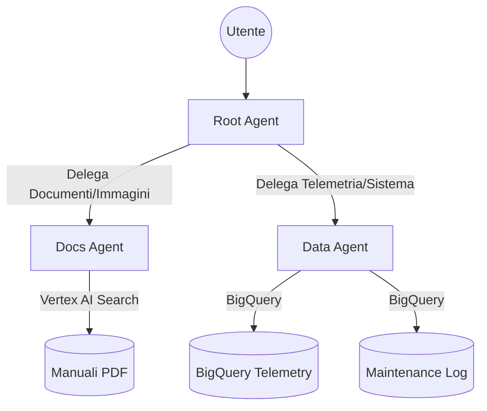

# Karlville Swiss: AI Maintenance Agent (POC)

Questo progetto implementa un assistente intelligente basato su agenti per la manutenzione predittiva e straordinaria dei macchinari Karlville Swiss (basati su PLC Beckhoff).

## 1. Architettura del Sistema

L'agente utilizza l'**Agent Development Kit (ADK)** di Google per orchestrare un sistema a nodi (Supervisor/Expert):
- **maintenance_agent (Root)**: Agisce come supervisore e router delle richieste.
- **docs_agent (Expert)**: Specializzato in RAG documentale e analisi immagini tecniche.
- **data_agent (Expert)**: Specializzato in telemetria BigQuery e operazioni di sistema.



## 2. Struttura del Progetto

```text
.
├── maintenance-agent/  # Codice sorgente dell'AI Agent (ADK)
│   ├── app/            # Logica dell'agente e dei tool
│   ├── evals/          # Set di valutazione
│   └── tests/          # Test unitari e integrazione
├── terraform/          # Infrastruttura Google Cloud (IAC)
├── docs/               # Manuali tecnici originali (PDF)
├── GEMINI.md           # Blueprint e specifiche tecniche
├── README.md           # Questa documentazione
└── CHANGELOG.md        # Registro delle modifiche
```

## 3. Setup Infrastruttura

Per configurare le risorse su Google Cloud:

1. Entra nella cartella terraform: `cd terraform`
2. Inizializza terraform: `terraform init`
3. Crea un file `terraform.tfvars` con le tue variabili.
4. Applica le modifiche: `terraform apply`

## 4. Sviluppo Agente

Il progetto dell'agente si trova in `maintenance-agent/`.

### Installazione Dipendenze
```bash
cd maintenance-agent
uv sync
```

### Test Locale
Per testare l'agente interattivamente nel Playground:

1.  **Naviga nella cartella dell'agente**:
    ```bash
    cd maintenance-agent
    ```
2.  **Imposta la variabile d'ambiente per il Service Account (PERCORSO ASSOLUTO!)**:
    ```bash
    export GOOGLE_APPLICATION_CREDENTIALS="$(pwd)/sa-key.json"
    ```
    *Nota*: Questo comando deve essere eseguito *nello stesso terminale* prima di avviare il Playground.
3.  **Avvia il Playground**:
    ```bash
    uv run agents-cli playground
    ```

### Tool Implementati
- **list_monitored_machines:** Restituisce l'elenco di tutti i Machine ID monitorati.
- **query_production_data:** Analizza la telemetria real-time con **mappatura automatica degli errori ADS** (es. 1808 -> Symbol not found).
- **Vertex AI Search Tool:** Ricerca documentale avanzata sui manuali PDF con citazione di fonte e pagina.
- **maintenance_scheduler:** Pianifica interventi di manutenzione su BigQuery.
- **get_system_user_info:** Recupera l'identità tecnica dell'utente (`user_id`, `session_id`).
- **BigQuery Toolset:** Supporto per query SQL dirette e analisi dello schema dati.

## 5. Funzionalità Avanzate
- **Multimodalità**: L'agente accetta immagini (foto di componenti) per confronti tecnici.
- **Grounding**: Risposte verificate con citazioni obbligatorie ai documenti sorgente.
- **ADS Mapping**: Traduzione automatica dei codici esadecimali Beckhoff in descrizioni leggibili.

## 6. Configurazione Sicurezza

L'agente utilizza un **Service Account dedicato** (`kv-swiss-agent-sa`) gestito via Terraform.
1. Terraform genera una chiave JSON in `maintenance-agent/sa-key.json`.
2. Il file `.env` punta a questa chiave per il supporto locale.
3. In produzione, viene utilizzata l'identità dell'ambiente GCP.
