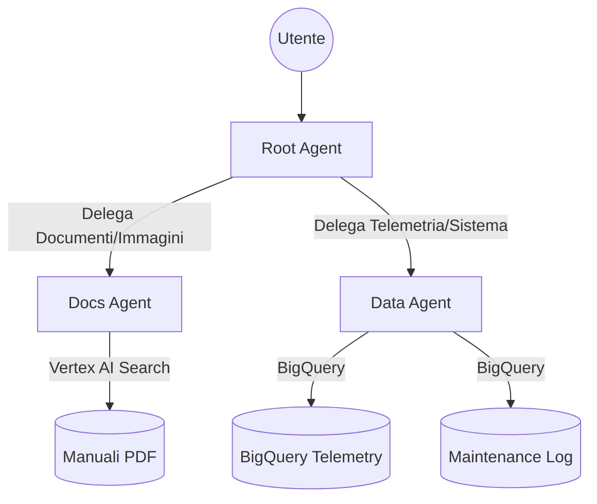

# POC: AI Maintenance Agent per Karlville Swiss

Questo progetto implementa un assistente intelligente per la manutenzione dei macchinari Karlville Swiss basati su tecnologia Beckhoff. L'agente integra dati di telemetria da BigQuery e documentazione tecnica tramite Vertex AI Search.

## Architettura

L'agente è strutturato con un modello a nodi (Supervisor/Expert):
- **maintenance_agent (Root)**: Coordina le richieste e delega agli esperti.
- **docs_agent**: Specializzato nella ricerca documentale sui manuali PDF (RAG). Supporta l'analisi di immagini.
- **data_agent**: Specializzato nell'interrogazione della telemetria real-time e nella gestione del sistema.



## Struttura del Progetto

```
maintenance-agent/
├── app/
│   ├── agent.py               # Definizione degli agenti e del grafo
│   ├── tools.py               # Implementazione dei tool custom (BQ, Identity)
│   ├── app_utils/
│   │   ├── ads_errors.py      # Utility per mappatura errori Beckhoff ADS
│   │   ├── telemetry.py       # Setup telemetria (OpenTelemetry)
│   │   └── typing.py          # Definizione tipi di feedback
├── evals/                     # Dataset di valutazione (.jsonl)
├── tests/                     # Test unitari e di integrazione
│   └── eval/                  # Configurazione e set di valutazione ADK
├── GEMINI.md                  # Istruzioni specifiche per lo sviluppo assistito
└── sa-key.json                # Chiave del Service Account per lo sviluppo locale (GIT IGNORED)
```

## Funzionalità Implementate

1. **RAG Avanzato**: Ricerca semantica sui manuali con citazione automatica della fonte e della pagina.
2. **Analisi Telemetria**: Interrogazione degli ultimi 100 log di telemetria per macchina con mappatura automatica dei codici errore ADS (es. 1808 -> Symbol not found).
3. **Pianificazione Interventi**: Registrazione di task di manutenzione direttamente su BigQuery.
4. **Identità di Sistema**: Recupero dinamico di `user_id` e `session_id` tramite `ToolContext`.
5. **Supporto Multimodale**: Capacità di analizzare foto di componenti e confrontarle con la documentazione (istruzioni di sistema configurate).

## Comandi Rapidi

### Installazione
```bash
agents-cli install
```

### Esecuzione Locale (Playground)
```bash
agents-cli playground
```

### Valutazione (Evaluation)
```bash
agents-cli eval run
```

### Test
```bash
uv run pytest tests/unit tests/integration
```

## Configurazione Ambiente

Assicurarsi di avere le seguenti variabili d'ambiente nel file `.env`:
- `GOOGLE_CLOUD_PROJECT`: ID del progetto GCP.
- `GOOGLE_CLOUD_LOCATION`: us-central1.
- `GOOGLE_APPLICATION_CREDENTIALS`: sa-key.json.
